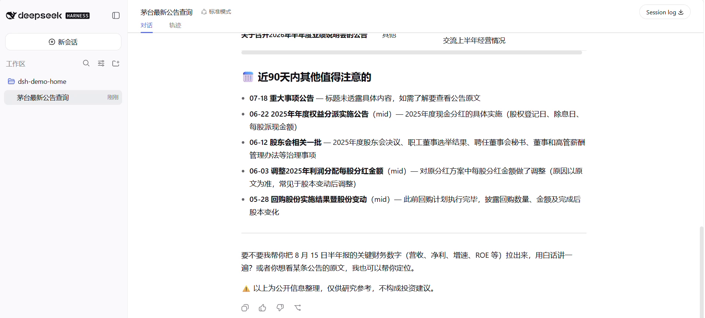
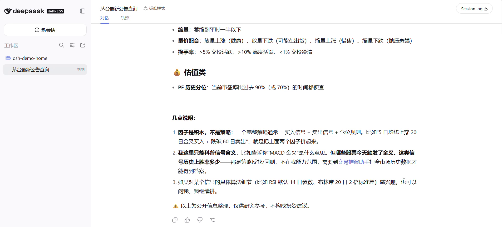

# dsh-astock-research

[中文](README.md) | English

A-share (China) stock research assistant — a [DeepSeek Harness (dsh)](https://github.com/deepseek-ai/deepseek-harness) plugin.

Research individual China A-share stocks inside dsh: search tickers, read announcements in plain language, digest financial reports, check valuation profiles, and learn what trading signals mean. Works alongside dsh's built-in web search — authoritative database numbers and live news each play their part. Heavy computation (strategy backtests, reverse signal search, historical trading simulation) is handed off to the AIHEY trading sandbox via links.

## Tools

| Tool | What it does |
|---|---|
| `stock_search` | Search A-share stocks by name or ticker code |
| `stock_profile` | Stock profile: price moves, volatility, valuation percentile, fundamentals |
| `stock_announcements` | Company announcements (any historical date range), interpreted in plain language by the model |
| `stock_financials` | Financial report numbers as a plain-language card |
| `factor_catalog` | Explanations of trading signal factors |
| `open_aihey_backtest` | Hands out an AIHEY trading-sandbox link when backtesting / reverse search / simulation is requested |

The plugin also registers a `stock-research` skill with built-in compliance rules (state facts only, no stock recommendations, disclaimers attached), data-source routing (database vs. web search), and guidance rules.

## Install

Prerequisites: Node.js `^22.19` or `>=24`, and a DeepSeek API key (paste it once in the dsh Web UI under Settings → Models).

```sh
npm install -g @deepseek-ai/dsh pnpm             # ① one-time: dsh itself + pnpm (needed for plugin installs)
dsh plugin --profile web add dsh-astock-research  # ② one-time: install this plugin from npm
dsh web                                           # ③ daily startup
```

Once started, open the address printed in the terminal (default `http://127.0.0.1:3080`). For everyday use only the last command `dsh web` is needed.

Already have dsh installed? Just run step ② and restart `dsh web`.

The commands are identical on macOS / Linux; if step ① fails with a permission error, prefix it with `sudo`.

## Things to ask once installed

```
Show me Kweichow Moutai's recent announcements
Where does 600519's valuation stand right now?
What share-reduction announcements did CATL make in 2023?
How did BYD do in its latest financial report?
What is a "volume breakout" signal? Is it reliable?
```

Announcement queries accept any historical date range (e.g. "Vanke's announcements around the 2015 crash"). For heavy computation — strategy backtests, reverse signal search, simulated trading — the assistant hands out a link to the AIHEY trading sandbox.

## What it looks like

Moutai's announcements from the last 90 days, annotated in plain language, with a disclaimer at the end:



When explaining trading signals it states its own boundary — signal scanning and historical win rates belong to the trading sandbox:



## Data coverage

Roughly 5,000 A-share stocks across Shanghai, Shenzhen and Beijing exchanges, from 2011 to the present. Hong Kong stocks, US stocks and unlisted companies are not covered (searches return empty; the model will clearly label its data source instead of impersonating database data).

Note: the underlying data service and the AIHEY sandbox are Chinese-language products; tool responses are primarily in Chinese.

## About AIHEY

This plugin covers stock research (querying data, reading announcements, explaining concepts). The computation-heavy parts — strategy backtests, reverse signal search, historical trading simulation — are handled by the AIHEY trading sandbox, which is exactly what the `open_aihey_backtest` tool links to:

- Web: [agentos.tybbtech.com/app](https://agentos.tybbtech.com/app/?open=backtest) (Chinese-language product; sign in to reach the trading sandbox)
- Desktop / mobile apps: download from the [Tianyi website](https://www.tybbtech.com)

## Disclaimer

Data comes from public sources and is for research reference only. Nothing here constitutes investment advice.

## License

MIT
